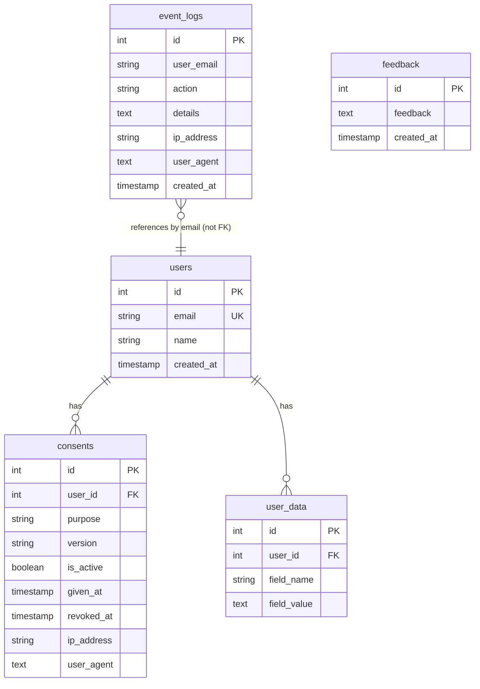
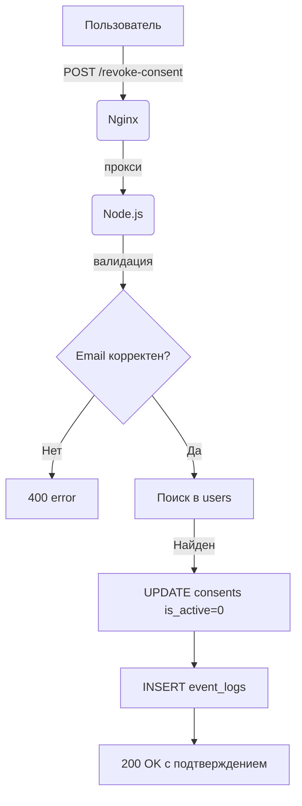
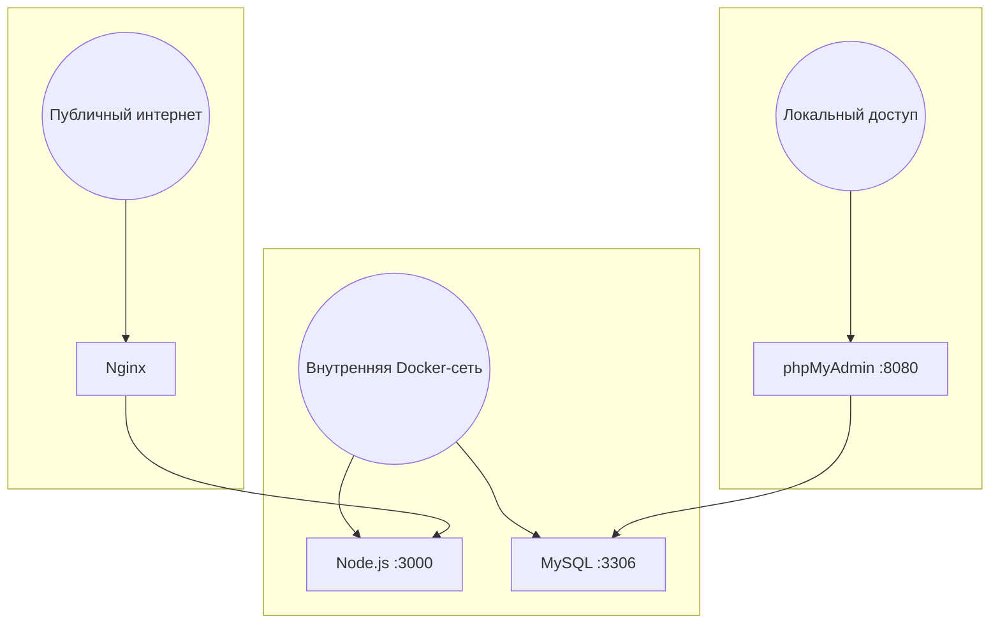
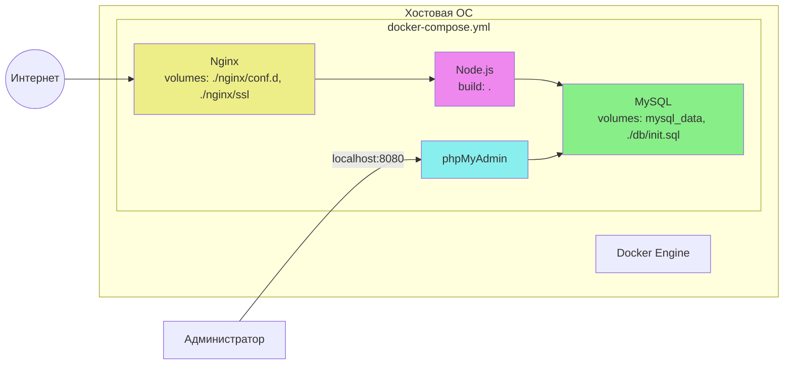

# Основной сайт — формально-юридическая модель защиты данных

Данный сайт является мини-разработкой, содержащей прототипы, в том числе формально-юридическую модель для демонстрации норм права в области защиты персональных данных.

## Разработчик

- Дмитриев Андрей  
- Электронная почта: annabankova950@gmail.com

По всем вопросам обращайтесь на указанный email.

## Лицензия

ISC

---

## Формально-юридическая модель защиты данных

В рамках дипломной работы разработана модель, реализующая требования Федерального закона №152-ФЗ «О персональных данных»:

- **Отзыв согласия на обработку ПДн** (ст. 9) – пользователь может отозвать ранее данное согласие, после чего данные подлежат удалению в течение 30 дней.
- **Право на забвение (удаление данных)** (ст. 21) – пользователь может запросить немедленное удаление своих персональных данных.
- **Право на выгрузку копии ПДн** (ст. 14) – пользователь может скачать свои данные в формате JSON.
- **Журналирование событий** – все юридически значимые действия (отзыв, удаление, экспорт) фиксируются с указанием IP-адреса, User-Agent и временной метки.
- **Шифрование канала связи** – весь трафик защищён протоколом HTTPS (самоподписанный сертификат для демонстрации, в продакшене следует использовать доверенный сертификат).

### Стек технологий

- **Nginx** – единственная точка входа: принимает запросы на портах 80 и 443, применяет лимиты (5 r/s, burst=10, max conn=10), проксирует запросы к Node.js на `http://node_app:3000`.
- Backend: Node.js + Express
- База данных: MySQL 8.0
- Администрирование БД: phpMyAdmin (веб-интерфейс)
- Аутентификация: сессии + CSRF-токены
- Безопасность: Helmet, rate limiting, honeypot, экранирование ввода
- Контейнеризация: Docker + Docker Compose
- Фронтенд: HTML5, CSS3 (адаптивный дизайн), JavaScript

### Структура базы данных

- `users` – зарегистрированные пользователи (субъекты ПДн)
- `consents` – история согласий на обработку ПДн
- `event_logs` – журнал юридически значимых событий
- `user_data` – дополнительные данные пользователя (для экспорта)
- `reviews` – отзывы (из основного сайта)

### Эндпоинты модели

- `POST /revoke-consent` – отзыв согласия
- `POST /delete-data` – удаление персональных данных
- `GET /export-data` – выгрузка копии ПДн в JSON

### Образцы юридических документов

На странице модели доступны для скачивания (вкладка «Образцы документов»):

- Жалоба в Роскомнадзор (нарушение прав субъекта ПДн)
- Исковое заявление в суд (компенсация морального вреда)
- Рапорт сотрудника полиции (обнаружение признаков преступления, ст. 272.1 УК РФ)
- Протокол осмотра интернет-страницы (фиксация цифровых доказательств)

Все файлы представлены в формате `.docx` (совместимы с Microsoft Word и LibreOffice).

---

## Соответствие законодательству

| Статья 152-ФЗ | Реализация в модели |
|---------------|----------------------|
| ст. 9 (согласие) | Пользователь даёт согласие при регистрации; может отозвать через форму |
| ст. 14 (доступ к ПДн) | Эндпоинт `/export-data` предоставляет копию данных в машиночитаемом формате |
| ст. 21 (удаление) | Эндпоинт `/delete-data` немедленно удаляет ПДн из БД |
| ст. 19 (безопасность) | HTTPS, CSRF, rate limiting, helmet, экранирование ввода |
| ст. 22 (уведомление РКН) | (в модели не реализовано, но описано в пояснительной записке как планируемое) |

---

## Быстрый запуск (Docker)

1. Установите [Docker Desktop](https://www.docker.com/products/docker-desktop).
2. Клонируйте репозиторий.
3. В корневой папке выполните:
   ```bash
   docker-compose up -d --build
   ```
## После запуска будут доступны:

- Сайт (сама модель) – http://localhost (примите предупреждение о небезопасном соединении — это из-за самоподписанного сертификата)

Примечание: HTTP-запросы автоматически перенаправляются на HTTPS (редирект 301). Для локального тестирования используется самоподписанный сертификат – браузер может показывать предупреждение, что ожидаемо для разработки. В production следует заменить сертификат на доверенный (например, Let's Encrypt).

- Страница формально-юридической модели – https://localhost:/ER

- phpMyAdmin (управление базой данных) – http://localhost:8080

- Тестовые данные
- Для проверки модели вводите email: demo@example.com (пароль не требуется, логин только по email). Этот пользователь уже есть в базе.

## Для входа в phpMyAdmin используйте:

- Сервер: mysql_db

- Пользователь: root

- Пароль: root_password (если вы не меняли)

- Просмотр базы данных через phpMyAdmin
Откройте браузер и перейдите на http://localhost:8080

- Введите учётные данные, указанные выше

- В левой колонке выберите базу my_diploma_db

- Вы увидите все таблицы: users, consents, event_logs, user_data, reviews

- Чтобы посмотреть логи юридических событий, откройте таблицу event_logs – там будут записи с IP-адресами, типом действия и временем.

- Адаптивный дизайн
Сайт оптимизирован для просмотра на различных устройствах: настольных компьютерах, планшетах и мобильных телефонах. Используются медиа-запросы и гибкая вёрстка.

## Запуск без Docker (для разработки)
- Установите Node.js и MySQL.

- Создайте базу данных my_diploma_db и пользователя (или используйте root).

- Скопируйте файл .env.example в .env (или создайте .env вручную) и пропишите:

ini
NODE_ENV=development
PORT=3000
HOSTNAME=localhost
DB_HOST=localhost
DB_USER=ваш_пользователь
DB_PASSWORD=ваш_пароль
DB_DATABASE=my_diploma_db
SESSION_SECRET=любая_секретная_строка
Установите зависимости:

```bash
npm install
```
Сгенерируйте самоподписанный сертификат для HTTPS (файлы key.pem и cert.pem) и поместите их в папку ssl/ в корне проекта.
Пример генерации через OpenSSL:

```bash
openssl req -x509 -newkey rsa:4096 -keyout ssl/key.pem -out ssl/cert.pem -days 365 -nodes
```
Запустите сервер:

```bash
npm start
```
Сервер будет доступен по адресу https://localhost:3000.

## Дополнительная информация
- Все зависимости описаны в package.json.

- Инициализация базы данных происходит автоматически при первом запуске контейнера (скрипт db/init.sql). При локальном запуске таблицы нужно создать вручную (или выполнить тот же скрипт).

- Журнал событий (event_logs) удобно просматривать через phpMyAdmin или через командную строку MySQL.

- Для корректного отображения кириллицы в базе данных используется кодировка utf8mb4.

- Образцы юридических документов находятся в папке public/samples/ и имеют формат .docx

## Схемы архитектуры

### 1. Компонентная архитектура

```mermaid
graph TB
    subgraph DockerHost [Docker Host]
        subgraph Network [app_network]
            Nginx[Nginx<br>ports: 80, 443]
            Node[Node.js<br>port: 3000 internal]
            MySQL[MySQL<br>port: 3306 internal]
            phpMyAdmin[phpMyAdmin<br>port: 8080 internal]
        end
    end
    Client[Клиент (браузер)] -->|HTTPS| Nginx
    Nginx -->|HTTP proxy| Node
    Node -->|SQL| MySQL
    phpMyAdmin -->|SQL| MySQL
    Admin[Администратор локально] -->|HTTP localhost:8080| phpMyAdmin
    style Nginx fill:#f9f,stroke:#333
    style Node fill:#bbf,stroke:#333
    style MySQL fill:#bfb,stroke:#333
    style phpMyAdmin fill:#ffb,stroke:#333
```






