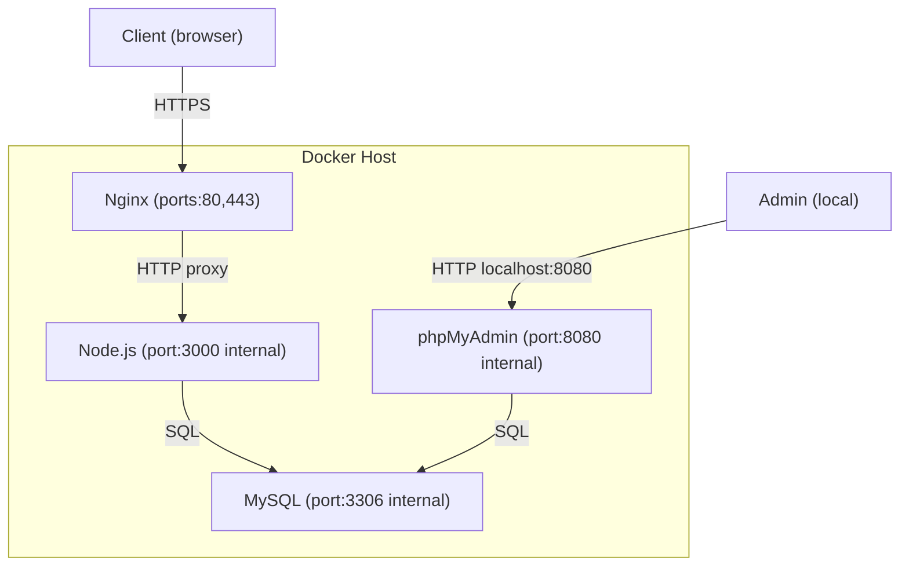
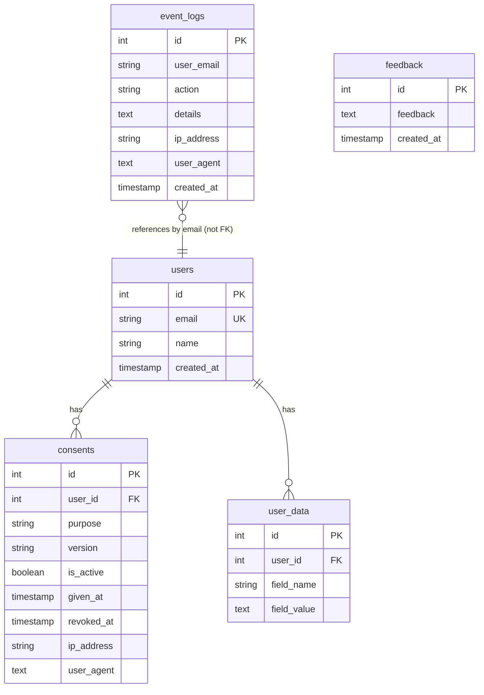
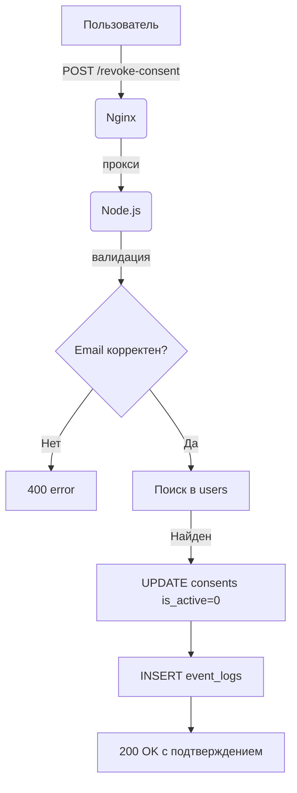
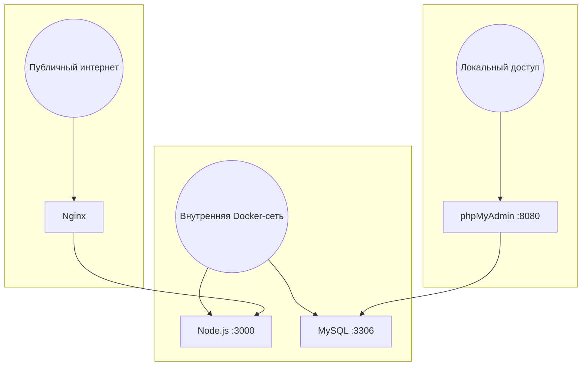
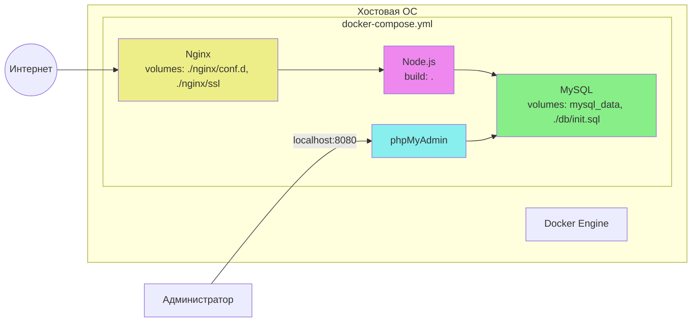

# Основной сайт — формально-юридическая модель защиты данных

Данный сайт является мини-разработкой, содержащей прототипы, в том числе формально-юридическую модель для демонстрации норм права в области защиты персональных данных.

## Разработчик

- Дмитриев Андрей  
- Электронная почта: annabankova950@gmail.com

По всем вопросам обращайтесь на указанный email.

## Лицензия

ISC

---

## Формально-юридическая модель защиты данных

В рамках дипломной работы разработана модель, реализующая требования Федерального закона №152-ФЗ «О персональных данных»:

  - **Отзыв согласия на обработку ПДн** (ст. 9) – пользователь может отозвать ранее данное согласие, после чего данные подлежат удалению в течение 30 дней.
  - **Право на забвение (удаление данных)** (ст. 21) – пользователь может запросить немедленное удаление своих персональных данных.
  - **Право на выгрузку копии ПДн** (ст. 14) – пользователь может скачать свои данные в формате JSON.
  - **Журналирование событий** – все юридически значимые действия (отзыв, удаление, экспорт) фиксируются с указанием IP-адреса, User-Agent и временной метки.
  - **Шифрование канала связи** – весь трафик защищён протоколом HTTPS (самоподписанный сертификат для демонстрации, в продакшене следует использовать доверенный сертификат).

### Стек технологий

  - **Nginx** – единственная точка входа: принимает запросы на портах 80 и 443, применяет лимиты (5 r/s, burst=10, max conn=10), проксирует запросы к Node.js на `http://node_app:3000`.
  - Backend: Node.js + Express
  - База данных: MySQL 8.0
  - Администрирование БД: phpMyAdmin (веб-интерфейс, доступен только с локального хоста)
  - Аутентификация: сессии + CSRF-токены
  - Безопасность: Helmet, rate limiting, honeypot, экранирование ввода
  - Контейнеризация: Docker + Docker Compose
  - Фронтенд: HTML5, CSS3 (адаптивный дизайн), JavaScript

### Структура базы данных

  - `users` – зарегистрированные пользователи (субъекты ПДн)
  - `consents` – история согласий на обработку ПДн
  - `event_logs` – журнал юридически значимых событий
  - `user_data` – дополнительные данные пользователя (для экспорта)
  - `reviews` – отзывы (из основного сайта)
  - `feedback` – предложения пользователей

### Эндпоинты модели

  - `POST /revoke-consent` – отзыв согласия
  - `POST /delete-data` – удаление персональных данных
  - `GET /export-data` – выгрузка копии ПДн в JSON

### Образцы юридических документов

На странице модели доступны для скачивания (вкладка «Образцы документов»):

  - Жалоба в Роскомнадзор (нарушение прав субъекта ПДн)
  - Исковое заявление в суд (компенсация морального вреда)
  - Рапорт сотрудника полиции (обнаружение признаков преступления, ст. 272.1 УК РФ)
  - Протокол осмотра интернет-страницы (фиксация цифровых доказательств)

Все файлы представлены в формате `.docx` (совместимы с Microsoft Word и LibreOffice).

---

## Соответствие законодательству

| Статья 152-ФЗ | Реализация в модели |
|---------------|----------------------|
| ст. 9 (согласие) | Пользователь даёт согласие при регистрации; может отозвать через форму |
| ст. 14 (доступ к ПДн) | Эндпоинт `/export-data` предоставляет копию данных в машиночитаемом формате |
| ст. 21 (удаление) | Эндпоинт `/delete-data` немедленно удаляет ПДн из БД |
| ст. 19 (безопасность) | HTTPS, CSRF, rate limiting, helmet, экранирование ввода |

---

## Быстрый запуск (Docker)

1. Установите Docker Desktop с официального сайта.
2. Клонируйте репозиторий.
3. В корневой папке выполните:

       docker-compose up -d --build

## После запуска будут доступны:

  - **Сайт (сама модель)** – `https://localhost` (примите предупреждение о небезопасном соединении — это из-за самоподписанного сертификата)
    Примечание: HTTP-запросы автоматически перенаправляются на HTTPS (редирект 301). Для локального тестирования используется самоподписанный сертификат – браузер может показывать предупреждение, что ожидаемо для разработки. В production следует заменить сертификат на доверенный (например, Let's Encrypt).

  - **Страница формально-юридической модели** – `https://localhost/ER`

  - **phpMyAdmin (управление базой данных)** – доступен **только на вашем компьютере** по адресу `http://localhost:8080` (порт привязан к `127.0.0.1`, поэтому извне подключиться невозможно).

  ⚠️ **Безопасность:** phpMyAdmin не должен быть доступен из интернета. В данном проекте он служит для удобства просмотра логов и таблиц разработчиком/системным администратором.

### Тестовые данные

Для быстрой проверки вы можете зарегистрироваться самостоятельно (пароль должен содержать не менее 8 символов, включая буквы, цифры и спецсимволы).  
*Ранее существовавший демо-пользователь `demo@example.com` без пароля удалён из-за внедрения полноценной авторизации.*

### Для входа в phpMyAdmin используйте:

  - Сервер: mysql_db
  - Пользователь: root
  - Пароль: root_password (если вы не меняли)

### Просмотр базы данных через phpMyAdmin

1. Откройте браузер и перейдите на `http://localhost:8080`
2. Введите учётные данные, указанные выше
3. В левой колонке выберите базу `my_diploma_db`
4. Вы увидите все таблицы: users, consents, event_logs, user_data, reviews, feedback
5. Чтобы посмотреть логи юридических событий, откройте таблицу `event_logs` – там будут записи с IP-адресами, типом действия и временем.

### Адаптивный дизайн

Сайт оптимизирован для просмотра на различных устройствах: настольных компьютерах, планшетах и мобильных телефонах. Используются медиа-запросы и гибкая вёрстка.

---

## Запуск без Docker (для разработки)

1. Установите Node.js и MySQL.
2. Создайте базу данных `my_diploma_db` и пользователя (или используйте root).
3. Скопируйте файл `.env.example` в `.env` (или создайте `.env` вручную) и пропишите:

       NODE_ENV=development
       PORT=3000
       HOSTNAME=localhost
       DB_HOST=localhost
       DB_USER=ваш_пользователь
       DB_PASSWORD=ваш_пароль
       DB_DATABASE=my_diploma_db
       SESSION_SECRET=любая_секретная_строка
       PASSWORD_PEPPER=ваша_секретная_строка

4. Установите зависимости:

       npm install

5. Сгенерируйте самоподписанный сертификат для HTTPS (файлы key.pem и cert.pem) и поместите их в папку `ssl/` в корне проекта. Пример генерации через OpenSSL:

       openssl req -x509 -newkey rsa:4096 -keyout ssl/key.pem -out ssl/cert.pem -days 365 -nodes

6. Запустите сервер:

       npm start

   Сервер будет доступен по адресу `https://localhost:3000`.

---

## Дополнительная информация

  - Все зависимости описаны в `package.json`.
  - Инициализация базы данных происходит автоматически при первом запуске контейнера (скрипт `db/init.sql`). При локальном запуске таблицы нужно создать вручную (или выполнить тот же скрипт).
  - Журнал событий (`event_logs`) удобно просматривать через phpMyAdmin или через командную строку MySQL.
  - Для корректного отображения кириллицы в базе данных используется кодировка utf8mb4.
  - Образцы юридических документов находятся в папке `public/samples/` и имеют формат `.docx`.
  - Политика конфиденциальности доступна по адресу `/privacy`.

---

## Схемы архитектуры (описание)

В дипломной работе приведены подробные схемы архитектуры, ER-диаграммы и блок-схемы. Ниже краткое текстовое описание:

1. **Архитектура компонентов (контейнеры и связи):**  
   Docker‑контейнеры: Nginx (порты 80,443), Node.js (3000 internal), MySQL (3306 internal), phpMyAdmin (8080 internal). Клиент общается с Nginx по HTTPS, Nginx проксирует на Node.js, Node.js обращается к MySQL. Администратор подключается к phpMyAdmin через localhost:8080.

2. **База данных (ER-диаграмма):**  
   Таблицы `users`, `consents`, `event_logs`, `user_data`, `reviews`, `feedback`. Связи: `users` → `consents` (один ко многим), `users` → `user_data` (один ко многим). `event_logs` ссылается на `users.email` (не внешний ключ).

3. **Блок-схема отзыва согласия:**  
   POST /revoke-consent → валидация email → поиск пользователя → обновление `consents.is_active=0` → вставка в `event_logs` → редирект на /ER.

4. **Многоуровневая модель доступа:**  
   Публичный интернет → только Nginx (порт 80/443). Локальный доступ (администратор) → phpMyAdmin:8080. Внутренняя Docker-сеть → Node.js:3000 и MySQL:3306.

5. **Docker-контейнеризация:**  
   Все сервисы описаны в `docker-compose.yml` с томами и сетями. Проброс портов только для Nginx (80,443) и phpMyAdmin (8080 на 127.0.0.1).

Для отображения отключите ADblock и прочие блокировщики рекламы

### 2. ER-диаграмма базы данных

### 3. Блок-схема отзыва согласия (POST /revoke-consent)

### 4. Многоуровневая модель разграничения доступа

### 5. Docker-контейнеризация и сетевые связи
